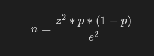

# Sampling Techniques For Imbalanced Dataset

## Introduction
This assignment shows the various oversampling and undersampling techniques to apply on imbalanced dataset in Machine Learning. The dataset used here is Credit Card Dataset. The dataset contains 772 observations and 31 features. It is a binary classification dataset with 763 observations belonging to class 0 and only 9 observations belong to class 1. Because of such a high imbalance, the following sampling techniques are used.

## Sampling Techniques
A total of 5 sampling techniques are used on the dataset which are as follows:

1. Random Under sampling
2. Random Over sampling
3. Tomek Links sampling
4. SMOTE(Synthetic Minority Oversampling Technique)
5. NearMiss sampling

After applying the above techniques, n samples are randomly chosen from the generated balanced dataset (except for Tomek link sampling). n is calculated as follows:

